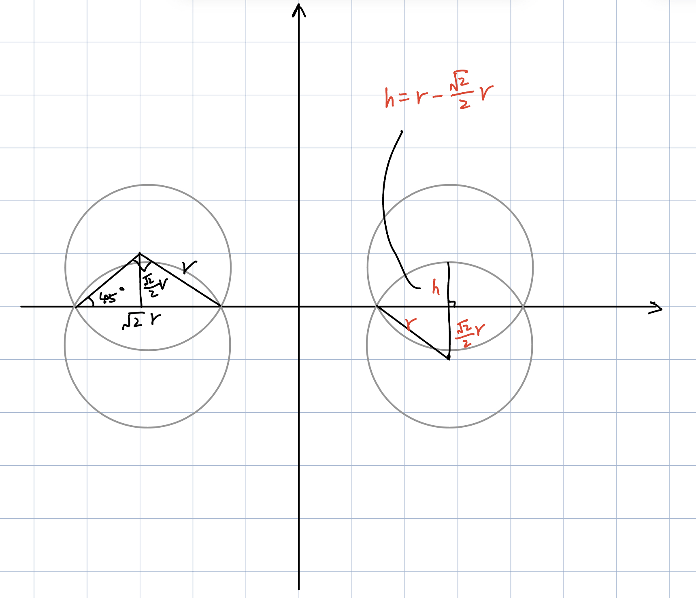
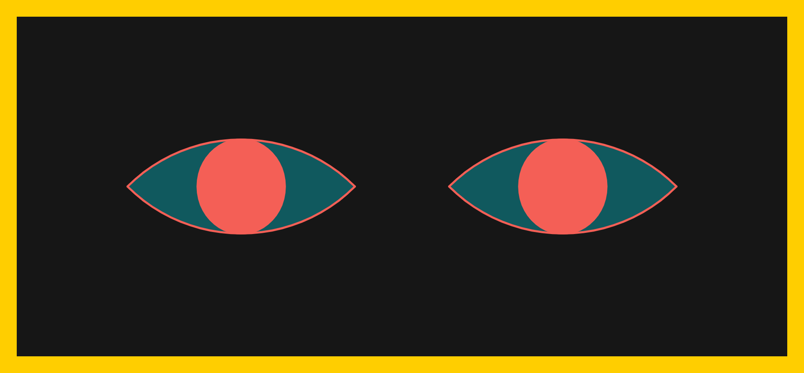
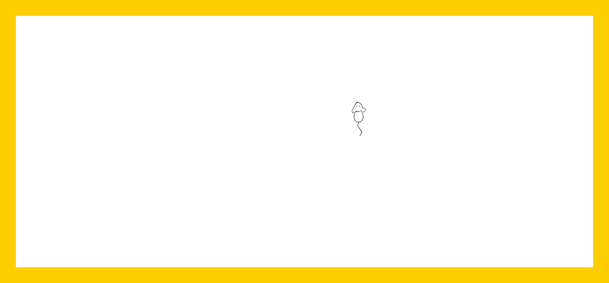

# Midterm Notes
## Milestone 1: Project Proposal
### Magazine: The Secret Life of Cats by National Geographic
I recently bought a magazine named "The Secret Life of Cats". It is a reissue of a national geographic favorite, which contains many beautiful photos of cats and interesting stories. It consists of three chapters: "Cats Then and Now", "The Human-Cat Bond", and "Cats in Our History". "Cats" in this magazine refer not only to domestic cats, but the whole Felidae family including tigers, panthers, and so on. Since I love cats, and there are many classic and understandable symbolic languages in human culture that refer to felines, I decided to design a cover for this magazine. 

### Planning
The cover will include the biological characteristics of the cats, such as their eyes, the patterns of their furs, their paws, their tails, and so on. It can also include things related to cats like catnip and fish. If appropriate, I will also include some human elements to showcase the human-cat bond. 

I designed the cover to be both interactive and time-based. Some possible plans are listed below: 
<ol>
  <li>Cat's eyes are drawn at the center of the magazine cover. When clicking on the digital magazine cover, a paw appears at the clicking position as if a cat responds to the click. The cat's eyes can also follow the mouse's movement (which happens to be a witty metaphor). </li>
  <li>The background color can change according to the current time of the day. The shape of cats' pupils can change according to the background color. For example, the darker the background is, the more rounded the cat's pupils are. </li>
  <li>The background can be filled with different patterns of different cat furs. It changes after every click on the background. </li>
</ol>

Users can switch among the three plans by pressing the left arrow and right arrow on their keyboard. 

To keep the branding of National Geographic, I decided to keep the yellow frame for every plan. The hexadecimal color code of National Geographic Yellow is `#ffce00`. 

From the perspective of interactivity, my project is related to our week 04 readings about interactivity. The interactivity levels of the three plans listed above are different, but I think they are all interactive because they engage people in a conversation about the magazine's content. While I may not do data visualization on my magazine cover, I do want to learn from W.E.B Du Bois's color choices and layouts and see if I can integrate them into my work. 

### Sketches
Below are some sketches of the cover: 
<table>
  <tr>
    <td></td>
    <td></td>
    <td></td>
    <td></td>
  </tr>
  <tr>
    <td>Plan 1: Mouse interaction with the cat on the cover </td>
    <td>Plan 2: Background color and the cat eyes' pupil size changes with time. </td>
    <td colspan="2">Plan 3: Background patterns representing different felines. </td>
  </tr>
</table>

## MileStone 2: Progress Update
This week, I started to code the interactive magazine covers. There will be 3 different covers in total: Cover 0 with cat eyes changing with time, Cover 1 with a cat responding to the mouse, and Cover 2 shows different cat fur patterns with a mouse click. Users can go to the previous/next cover by pressing the left/right arrow button. 

So far, I have finished Cover 0 and started Cover 1. My detailed progress is below. 

### Functions
Since there are 3 different covers, I put each of them in a function so that `draw()` can select one to draw based on the current `coverIndex` value. The 3 functions are `drawCover0()`, `drawCover1()`, and `drawCover2()`. 

The changing of cover is handled by the function `keyPressed()`. If the left arrow key is pressed, the cover will change to the previous one, or the last one if the current one is already the first one in the covers. Pressing on the right arrow key will do the opposite. 

### Cover 0
Cover 0 shows a pair of cat eyes changing with time. Since it is based on time, I adapted the color rules in HW04A (a mechanism that keeps track of time) to this cover. 

As for the eyes, each eye consists of two arcs and one ellipse. The angles of the arcs are all PI/2 radius because it facilitates the calculations of eye position and pupil height (ellipse height). The pupil height is always the same as the largest distance between two arcs, but its width changes with time: the ellipse becomes a circle when the current hour is 0 or 23, and 20% of its height when the current hour is 11 or 12. This matches with cats' behavior: their pupils are nearly circles when the environment is dark (at night), which become sharp and thin ellipses when the environment is bright (at day). 

Below is my sketch for eye and pupil position calculation. 

Below is a screenshot of Cover 0.

### Cover 1
Cover 1 will have a cat responding to the mouse movement and mouse clicks. The cat's eyes will follow the mouse's movement, and a cat paw will appear where the mouse click happens. So far, I have created a mouse image and let it move with the digital mouse on canvas. Next, I will draw a cat on the canvas and animate its eyes. It will be a simple animation: for example, if the mouse is left to the cat, its eyes will animate towards the left within a certain range. When a mouse click event happens, `mouseClicked()` check if the current `coverIndex` is 1; if so, draw a paw at the clicked position. There can be a global counter so that we can let the paw image remain on canvas for a few seconds. 

Below is a screenshot of the Cover 1 (to be continued).

### Cover 2
Cover 2 shows different cat fur patterns with a mouse click. This is an easy interaction: I just need the function `mouseClicked()`, and check if the current `coverIndex` is 2; if so, go to the next cat fur pattern in the pattern series. 

The difficult part may be pattern production: it can be static or animated, but some patterns may be hard to code. However, for non-overlapping shapes on canvas, maybe I can refer to HW03B. 
