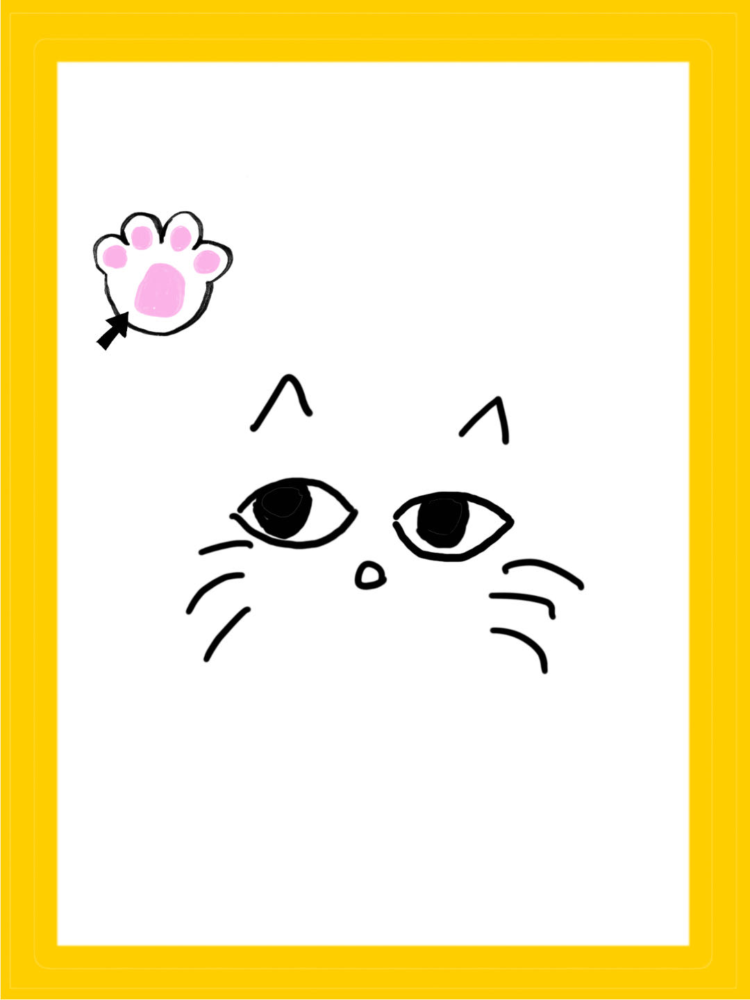
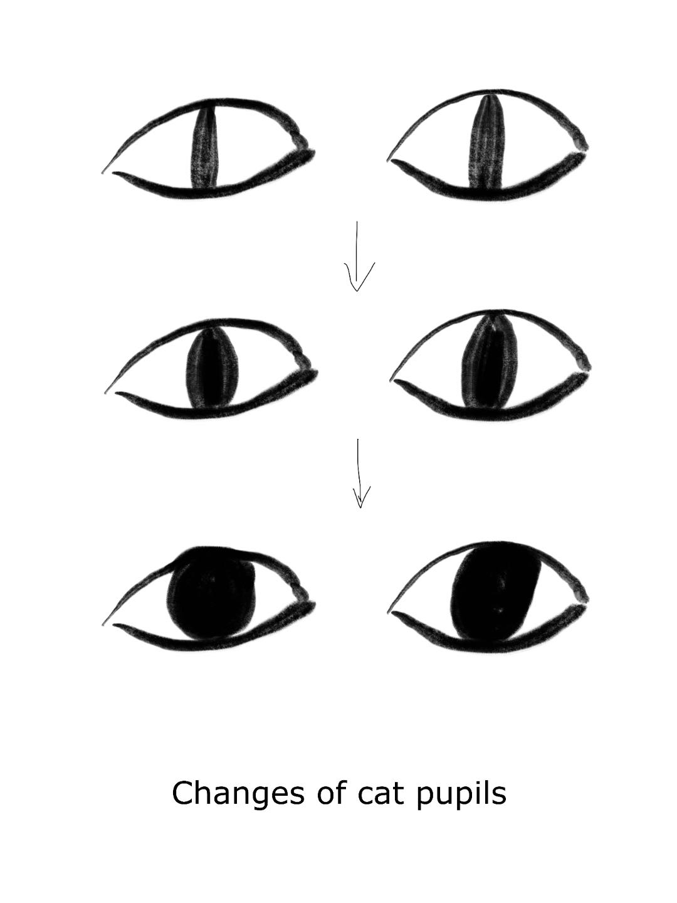
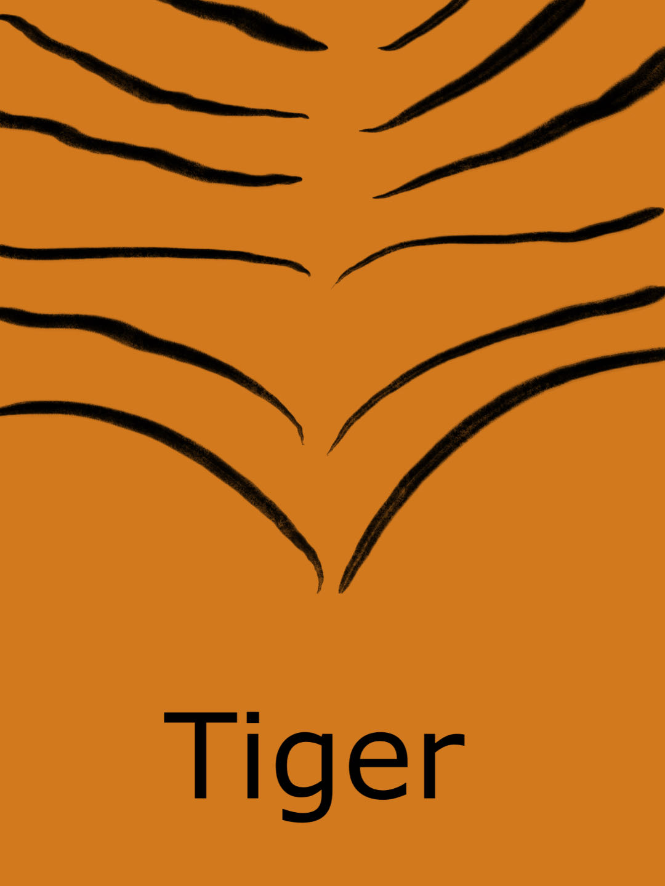
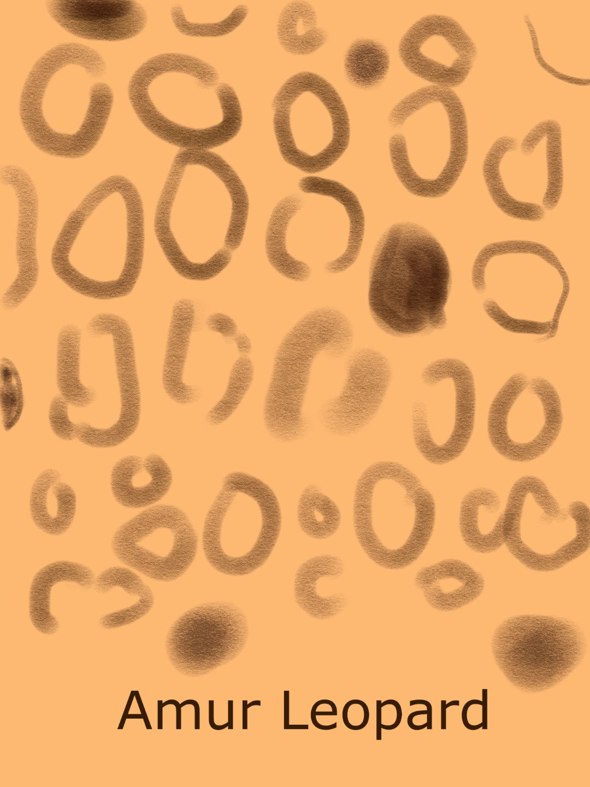

# Midterm Notes
## Milestone 1: Project Proposal
### Magazine: The Secret Life of Cats by National Geographic
I recently bought a magazine named "The Secret Life of Cats". It is a reissue of a national geographic favorite, which contains many beautiful photos of cats and interesting stories. It consists of three chapters: "Cats Then and Now", "The Human-Cat Bond", and "Cats in Our History". "Cats" in this magazine refer not only to domestic cats, but the whole Felidae family including tigers, panthers, and so on. Since I love cats, and there are many classic and understandable symbolic languages in human culture that refer to felines, I decided to design a cover for this magazine. 

### Planning
The cover will include the biological characteristics of the cats, such as their eyes, the patterns of their furs, their paws, their tails, and so on. It can also include things related to cats like catnip and fish. If appropriate, I will also include some human elements to showcase the human-cat bond. 

I designed the cover to be both interactive and time-based. Some possible plans are listed below: 
<ol>
  <li>Cat's eyes are drawn at the center of the magazine cover. When clicking on the digital magazine cover, a paw appears at the clicking position as if a cat responds to the click. The cat's eyes can also follow the mouse's movement (which happens to be a witty metaphor). </li>
  <li>The background color can change according to the current time of the day. The shape of cats' pupils can change according to the background color. For example, the darker the background is, the more rounded the cat's pupils are. </li>
  <li>The background can be filled with different patterns of different cat furs. It changes after every click on the background. </li>
</ol>

Users can switch among the three plans by pressing the left arrow and right arrow on their keyboard. 

To keep the branding of National Geographic, I decided to keep the yellow frame for every plan. The hexadecimal color code of National Geographic Yellow is `#ffce00`. 

From the perspective of interactivity, my project is related to our week 04 readings about interactivity. The interactivity levels of the three plans listed above are different, but I think they are all interactive because they engage people in a conversation about the magazine's content. While I may not do data visualization on my magazine cover, I do want to learn from W.E.B Du Bois's color choices and layouts and see if I can integrate them into my work. 

### Sketches
Below are some sketches of the cover: 
<table>
  <tr>
    <td></td>
    <td></td>
    <td></td>
    <td></td>
  </tr>
  <tr>
    <td>Plan 1: Mouse interaction with the cat on the cover </td>
    <td>Plan 2: Background color and the cat eyes' pupil size changes with time. </td>
    <td colspan="2">Plan 3: Background patterns representing different felines. </td>
  </tr>
</table>
