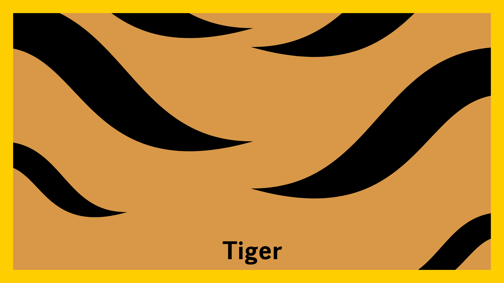
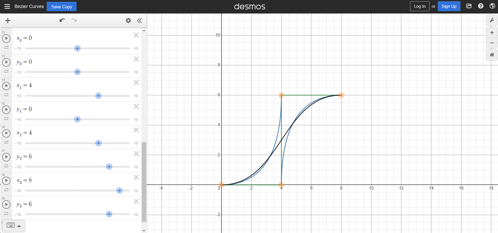

# Midterm Notes
## Milestone 1: Project Proposal
### Magazine: The Secret Life of Cats by National Geographic
I recently bought a magazine named "The Secret Life of Cats". It is a reissue of a national geographic favorite, which contains many beautiful photos of cats and interesting stories. It consists of three chapters: "Cats Then and Now", "The Human-Cat Bond", and "Cats in Our History". "Cats" in this magazine refer not only to domestic cats, but the whole Felidae family including tigers, panthers, and so on. Since I love cats, and there are many classic and understandable symbolic languages in human culture that refer to felines, I decided to design a cover for this magazine. 

### Planning
The cover will include the biological characteristics of the cats, such as their eyes, the patterns of their furs, their paws, their tails, and so on. It can also include things related to cats like catnip and fish. If appropriate, I will also include some human elements to showcase the human-cat bond. 

I designed the cover to be both interactive and time-based. Some possible plans are listed below: 
<ol>
  <li>Cat's eyes are drawn at the center of the magazine cover. When clicking on the digital magazine cover, a paw appears at the clicking position as if a cat responds to the click. The cat's eyes can also follow the mouse's movement (which happens to be a witty metaphor). </li>
  <li>The background color can change according to the current time of the day. The shape of cats' pupils can change according to the background color. For example, the darker the background is, the more rounded the cat's pupils are. </li>
  <li>The background can be filled with different patterns of different cat furs. It changes after every click on the background. </li>
</ol>

Users can switch among the three plans by pressing the left arrow and right arrow on their keyboard. 

To keep the branding of National Geographic, I decided to keep the yellow frame for every plan. The hexadecimal color code of National Geographic Yellow is `#ffce00`. 

From the perspective of interactivity, my project is related to our week 04 readings about interactivity. The interactivity levels of the three plans listed above are different, but I think they are all interactive because they engage people in a conversation about the magazine's content. While I may not do data visualization on my magazine cover, I do want to learn from W.E.B Du Bois's color choices and layouts and see if I can integrate them into my work. 

### Sketches
Below are some sketches of the cover: 
<table>
  <tr>
    <td></td>
    <td></td>
    <td></td>
    <td></td>
  </tr>
  <tr>
    <td>Plan 1: Mouse interaction with the cat on the cover </td>
    <td>Plan 2: Background color and the cat eyes' pupil size changes with time. </td>
    <td colspan="2">Plan 3: Background patterns representing different felines. </td>
  </tr>
</table>

## MileStone 2: Progress Update
This week, I started to code the interactive magazine covers. There will be 3 different covers in total: Cover 0 with cat eyes changing with time, Cover 1 with a cat responding to the mouse, and Cover 2 shows different cat fur patterns with a mouse click. Users can go to the previous/next cover by pressing the left/right arrow button. 

So far, I have finished Cover 0 and started Cover 1. My detailed progress is below. 

### Functions
Since there are 3 different covers, I put each of them in a function so that `draw()` can select one to draw based on the current `coverIndex` value. The 3 functions are `drawCover0()`, `drawCover1()`, and `drawCover2()`. 

The changing of cover is handled by the function `keyPressed()`. If the left arrow key is pressed, the cover will change to the previous one, or the last one if the current one is already the first one in the covers. Pressing on the right arrow key will do the opposite. 

### Cover 0
Cover 0 shows a pair of cat eyes changing with time. Since it is based on time, I adapted the color rules in HW04A (a mechanism that keeps track of time) to this cover. 

As for the eyes, each eye consists of two arcs and one ellipse. The angles of the arcs are all PI/2 radius because it facilitates the calculations of eye position and pupil height (ellipse height). The pupil height is always the same as the largest distance between two arcs, but its width changes with time: the ellipse becomes a circle when the current hour is 0 or 23, and 20% of its height when the current hour is 11 or 12. This matches with cats' behavior: their pupils are nearly circles when the environment is dark (at night), which become sharp and thin ellipses when the environment is bright (at day). 

Below is my sketch for eye and pupil position calculation. 

Below is a screenshot of Cover 0.

### Cover 1
Cover 1 will have a cat responding to the mouse movement and mouse clicks. The cat's eyes will follow the mouse's movement, and a cat paw will appear where the mouse click happens. So far, I have created a mouse image and let it move with the digital mouse on canvas. The image is loaded in the 'preload()' function. 

For the next step, I will draw a cat on the canvas and animate its pupils. For example, if the mouse is left to the cat, its eyes will animate towards the left within a certain range. Since the pupils have a moving function, I will need a `class Pupil()`. The class will first define the properties of the pupil shape, which can also be time-dependent like in Cover 0. Then, the class will also have the `draw()` function, which will handle the position changes of a pupil. 

Another thing I will implement is the mouse-clicking event. When the mouse is clicked, `mouseClicked()` checks if the current `coverIndex` is 1; if so, draw a paw at the clicked position. There can be a global counter so that we can let the paw image remain on canvas for a few seconds or frames. 

Below is a screenshot of the Cover 1 (to be continued).

### Cover 2
Cover 2 shows different cat fur patterns with a mouse click. This is an easy interaction: I just need the function `mouseClicked()`, and check if the current `coverIndex` is 2; if so, go to the next cat fur pattern in the pattern series. 

Pattern production may be difficult because I will need to code the patterns out. However, I can refer to HW03B if there is a need for randomly distributed non-overlapping shapes. Since there will be many objects with the same set of properties for every pattern (e.g. All stripes on the tiger’s fur have the same set of properties like position, color, length, etc.), I will create an object for each pattern. For example, a `tigerPattern` object will be created for painting the tiger pattern. 

## Milestone 3: Project Finished
This week, I finished the midterm project. Below is a summary of my project. 

### Function: cover switching
As updated in Milestone 2, the viewer can switch between 3 cover themes I created. This is achieved by `function keyPressed()`. 

### Cover 0: Cat Clock
Cover 0 remains the same as updated in Milestone 2. There is no interactive element. However, the pupil shape, the background color, and the eye colors change along with time. 

The code for cover 0 is in `function drawCover0()`. 

<table>
  <tr>
    <td></td>
    <td></td>
  </tr>
  <tr>
    <td>Cover at 0 AM</td>
    <td>Cover at 8 AM</td>
  </tr>
  <tr>
    <td></td>
    <td></td>
  </tr>
  <tr>
    <td>Cover at 12 PM</td>
    <td>Cover at 23 PM</td>
  </tr>
</table>

### Cover 1: Interactive Digital Cat
Cover 1 is a cat that interacts with the viewer's mouse. The cat's pupils follow the mouse movement; if click the mouse, the cat will try to "catch" the mouse with its paw. 

I broke down the interactions into several parts with explanations below.

#### Cat face drawing
Drawing a cat's face is more difficult than just drawing geometric shapes because everything should be positioned and proportioned to look harmonious and recognizable as a cat face. Therefore, I defined the `r1` variable in `setup()` as `windowWidth/20`, which is the distance between the canvas center and the initial center of a cat pupil. Almost all the variables of Cover 1 are related to r1, which allows easy management of shape positions and sizes. 

Then, `r1` is passed to `function catFace(r)`. This function draws everything on the cat face: pupils, nose, ears, and beards. Pupils drawing will be explained in the next subsection. Nose and ears drawing are relatively easy because they are formed by basic shapes. 

However, drawing beards took me a long time to finish. I referred to [this tutorial](https://p5js.org/learn/curves.html) to draw curved lines. Initially, I decided not to use `arc` because cat beards are not exactly in arc shapes. Then, I chose to use `curve()` for beards but soon found it not intuitive enough for me to control. Finally, I chose `bezier()`, which provides the most intuitive curve control among the three. As mentioned previously, the position and curve control of every bezier curve are related to `r1`. 

#### Function 1: pupil movement
Pupil movement is achieved by `function drawPupils()`. Initially, I sectioned the x-axis into 3 parts: left to the left eye, between two eyes, and right to the right eye. However, it became rather messy when converting this plan into code. 

After several rounds of modifications to the function, I suddenly realized that this was a simple mapping problem: I could simply map the window size to the range of movement of the two eyes. Therefore, I used `map()` for the x and y positions of the eyes. 

#### Function 2: show a paw at the clicking position
This function is achieved by `function mouseClicked()`. When `coverIndex` is 1, `pawX` and `pawY` are set to the current `mouseX` and `mouseY`. Then, a new instance of `class Paw` is created and pushed to the `paws` list. 

Inside `function drawCover1()`, only the paw instances that have `timer` property of less than 100 will be drawn on the canvas. Then, each paw instance's  `timer` property is updated (increased by 1, as coded in `class Paw`). This process makes sure that only a few new paws are drawn. 

The mouse image and the paw image are drawn by myself. 

<table>
  <tr>
    <td></td>
    <td></td>
  </tr>
</table>

### Cover 2: Feline Fur Patterns
The last cover I developed is the feline fur patterns. This cover provides several patterns of feline animals for the viewer to choose from by clicking on the canvas. 

#### Pattern 1: Tiger

Tiger pattern is more difficult to reproduce through programming because they consist of shapes with curvy outlines. Upon searching on custom shape creation, I found [this webpage](https://programmingdesignsystems.com/shape/custom-shapes/index.html) with interactive curve drawing canvases. I learned that the function set of `beginShape()`, `vertex()`, `bezierVertex()`, and `endShape` could solve my problem. There are other curve functions like `quadraticVertex()`, too, but I think Bézier curves are what I need for tiger strips. 

However, it was not easy to shape the curves. I finally found a [Bezier curve generator](https://www.desmos.com/calculator/cahqdxeshd) to try out different point positions to define a Bezier curve, and I did find a set of rules to follow to create the curve shape I wanted. The rules are: let y0 = y1, x1 = x2, y2 = y3, (x1 - x0) = (x3 - x2). Below is a screenshot of the curve shape by following these rules. 

Then, I applied the rules to create a single tiger strip. This is achieved by `function tigerStrip(x,y)` and `function tigerPattern()`. The final pattern has its size related to the window size. 

#### Pattern 2: Amur Leopard

Amur Leopard pattern is easier to create because I could refer to the HW03B code. The high-level logic is to create non-overlapping "dots". However, different from HW03B code, this time I created the `class LeopardDot` with all the properties and functions that a single leopard dot needs to be shown on the canvas. Moreover, the dots are not circles but arcs to better imitate Amur Leopard's fur pattern. Each arc is rotated at a random angle ranging from 0 to 2*PI radians so that the arc gaps are facing in different directions. 

#### Function: change pattern upon a mouse click
This is the last function introduced in this file. To achieve the function of changing pattern upon a mouse click, the `function mouseClicked()` first checks if `coverIndex` is 2. If so, the pattern will change to the next one in the pattern series. Currently, there are only two patterns in my project, but it is easy to add more patterns to the pattern series in the future. 
